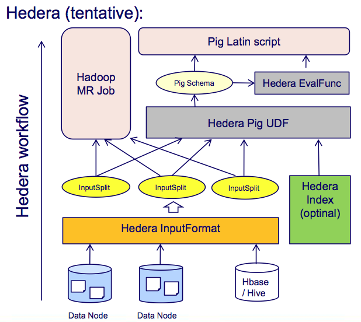

Hedera
======

##### Efficient Processing Tool for Versioned Textual Documents ###

Hedera is a framework to facilitate the rapid development of
processing methods on big versioned
document collections  using the Hadoop framework. It provides
customized InputFormat for accessing data in parallel in standard
MapReduce workflows. It also has new mechanism of extracting and
transforming while loading (versus the traditional Extraction,
Transformation, Loading or ETL) to reduce the IO burden when passing
large amounts of data through a cluster. Hedera can be
used in Hadoop Streaming to enable rapid development using different
languages (Java, Python, C, etc.) , and it also supports Pig with
a number of User-defined functions (UDFs). At the moment, the
framework has been tested in Hadoop CDH 4.x and Pig 0.11.x. It
supports both Hadoop YARN and non-YARN models. Free for research and
educational purpose under GNU and Common Creative License.

### Why Hedea ?##

While there are several frameworks built to support
processing big textual data (both in MapReduce and non-MapReduce
fashion), little has been focused on efficient processing of versioned
document collections such as Web archives, revisions of collaborated
documents (news articles or encyclopedia pages such as Wikipedia). As
compared to traditional corpora, versioned documents have some following
special characteristics: 

- One documents have several snapshots, each typically associated with
one specific timestamps indicating the publication time. Snapshots
should not be considered independent documents, but rather siblings
connected to one document identity.

- Document snapshots' contents are highly redundant. In practice, most
  of consecutive snapshots are generated to fix meticulous
  details, typos, etc. from the previous ones.

- Big changes in content of a document often come in narrow time
  period (minutes or within a day) as a response to the addition of one truly new
  information or the revising of important text snippets. This bursty
  behaviour should be exploited for efficient processing of text

- In traditional text corpora, document distribution is skew, some
  have big chunks of text while other can contain a few words. In
  versioned documents, the degree of skewness goes even higher. For
  example, in Wikipedia revisions, some snapshots of a page can amount
  up to 10 GB of texts, and some (such as redirects) just have a few
  Kilobytes. Any parallel framework must take this into account to
  support better load balancing without sacrifying the
  inter-dependences of snapshots within one document.

Hedera was built with those questions in mind. It uses Hadoop
frameworks to support the scalable and parallel processing of data in
high level programming languages. It optimizes
the operations and APIs to address the above challenges, while still
conforms to the MapReduce standards and support traditional
workflows. Hedera aims to support rapid development of experimental
models, and to this extent it tries to rely less on heavy
general-purpose frameworks built for enterprise environments (such as
ElasticSearch, etc.). The philosophy of Hedera is 

>Get dirty things done, and get them done quick, bro !! 

### Approach ##

Above is the (draf) sketch of Hedera architecture. Hedera inherits the
Hadoop architecture and provides several customization to address its
mentioned research questions. Some of features (established and
desired) of Hedera includes:

1. *Two-level Load Balancing*: As a typical Hadoop setting, Hedera
  feeds the Mapper with InputSplits. Each InputSplit object contain a
  self-described piece of text and will be processed in
  parallel. Hedera splits versioned documents via two levels:
	- Level 1: Each InputSplit contains a set of full snapshots of
      documents.
	- Level 2: Each InputSplit is read using an ETLReader
      implementation to output several Mapper input. Each Mapper input
      contains document header, a set of related snapshots or their
      differentials, depending on one particular job. Here the
      "relatedness'' is defined using a factory of Hedera methods, and
      is extensible to faciliate new processing requirements.
	  
2. *Incremental Processing*: When used for indexing or information
   extraction jobs, Hedera provides the option to work with 
   differentials instead of many duplicated texts. A Hedera reader
   checks for two snapshots and outputs only their changes to the next
   step of the workflow. This helps reducing a huge amount of text
   sent around the network, and in many cases it is sufficient to
   look only the changes in the job. When original text is needed, a
   Reconstructor can be called to communicate with related objects
   (via the ids stored in the header of the messages), and it 
   re-builds the content in reducer phase at will.

3. *Fast Approximated Reader and Extractor on the go*: In many cases,
   versions of one documents can differ
   by only a few minor tokens, and those differences are irrelevant
   for many information extraction jobs. Hedera provides a fast way to
   skip redundant snapshots and only triggers the extraction when
   detecting the big changes in semantics of the documents. A typical
   workflow for a fast extraction

  
  
